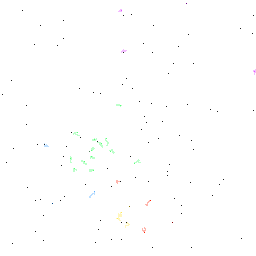

# Ants
"Ants" are an extension of an example given by David Silver in his
[video lecture][david-silver-videolecture-3]. Two ant dynasties are fighting
over randomly distributed resources in an environment. Ants get positive reward
signal when they kill non related ants, pick up food, and deliver food to nest.
They get negative reward for being killed and per move. Ant is characterized
its `x` and `y` coordinate in a grid and by its direction. The direction
dictates which three adjacent cells to `x:y` the ant can "sense".

In the following scenario, the ant's direction is "left" as it can "sense" the
cells to the left.
```text
 x-1  x  x+1
+---+---+---+
| o |   |   |  y-1
+---+---+---+
| o | A |   |  y
+---+---+---+
| o |   |   |  y+1
+---+---+---+
```

Each dynasty has got N ants. When ants are killed they cost food to re-spawn.
Therefore a dynasty which is proficient at gathering food will, besides reward
signal, be benefiting from more ants. Each ant has a limited life span, which is
why each move ants get negative reward signal in default case.

All dynasty ants share the same policy and value function.

Each ant leaves for M moves a trail. Related ants are able to distinguish
between `n in N`. For enemy trail, ant only "senses" whether it exists or not.
I am hoping this could lead to specializations of ants (i.e. ant #3, #25 and
#40 are explorers while other are exploiters).

1. Making it more likely to spawn new nutrients in some areas of the environment
    should make for more interesting play.
2. Create an environment for each core to learn in parallel.
3. [x] Allow multiple dynasties in one environment.
4. Implement a genetic algorithm that competes with the RL one.
5. Spawning new ants gets more expensive with number of ants.
6. Each environment is an episode. When all but one dynasty is wiped, order them
    by how long they survived. Then take the two fittest, combine their value
    functions, and replace the least fit dynasty by this new one.
7. Generate "king of the hill" scenario. Set higher negative reward for certain
    radius (because ants have to climb uphill), but in the centre of the circle
    set high probability of food spawn.
8. When a dynasty dies off, their other dynasty can take over their nest.




*Ants moving according to a random policy*

## Notes
If this is not a RL learning, why not? If we're given just some small view into
the environment, isn't this the best we can do? What would have to be change for
this to categorize as RL.

<!-- Invisible List of References -->
[david-silver-videolecture-3]: https://youtu.be/Nd1-UUMVfz4?t=1771
